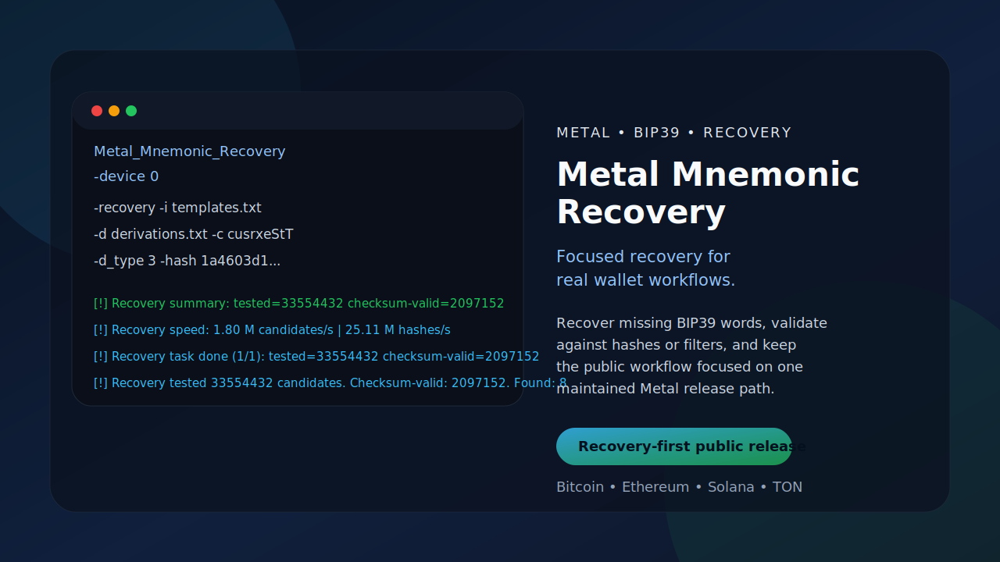
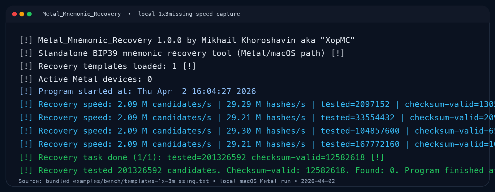

# Metal_Mnemonic_Recovery

<p align="center">
  <a href="#english"><strong>English</strong></a> |
  <a href="#russian"><strong>Русский</strong></a>
</p>

<a id="english"></a>
<p align="center">
  
</p>

<p align="center">
  
  
  
  
</p>

Author: Mikhail Khoroshavin aka "XopMC"

`Metal_Mnemonic_Recovery` is a macOS recovery tool for incomplete BIP39 phrases. It keeps the practical recovery workflow of the original CUDA project, but the active production implementation is adapted for Metal on Apple GPUs.

This repository is a full Metal adaptation of [XopMC/CUDA_Mnemonic_Recovery](https://github.com/XopMC/CUDA_Mnemonic_Recovery). The CUDA repository remains the upstream reference for the original recovery workflow and project lineage; this repository is the maintained Metal/macOS branch.

## Why This Project Exists

- Recover real BIP39 phrases with missing words marked as `*`.
- Validate candidates against exact hashes, Bloom filters, and XOR filters instead of browsing raw noise.
- Keep one focused recovery CLI for Bitcoin-like targets, Ethereum, Solana, and TON.
- Preserve the public recovery-oriented CLI and `Found:` output shape while running the heavy work on Apple GPUs through Metal.

## Scope

- Platform: macOS with Metal support
- GPU API: Metal 3
- Public mode: recovery-only CLI
- Targets: BTC compressed/uncompressed/segwit/taproot/xpoint, ETH, Solana, TON short/all
- Derivation policies: `-d_type 1`, `2`, `3`, `4`
- Primary validation target: Apple Silicon Macs

This repository documents only the supported Metal/macOS mainline path. It does not ship public release flows outside the maintained macOS and Metal scope.

## Quick Start

Recover one missing word against the bundled compressed exact-hash fixture:

```bash
./out/build/macos-metal-release/bin/Metal_Mnemonic_Recovery \
  -device 0 \
  -recovery "adapt access alert human kiwi rough pottery level soon funny burst *" \
  -d examples/derivations/default.txt \
  -c c \
  -hash 1a4603d1ff9121515d02a6fee37c20829ca522b0
```

Recover templates from a file:

```bash
./out/build/macos-metal-release/bin/Metal_Mnemonic_Recovery \
  -device 0 \
  -recovery -i examples/templates.txt \
  -d examples/derivations/default.txt \
  -c c \
  -hash 1a4603d1ff9121515d02a6fee37c20829ca522b0
```

Run Solana exact recovery:

```bash
./out/build/macos-metal-release/bin/Metal_Mnemonic_Recovery \
  -device 0 \
  -recovery "adapt access alert human kiwi rough pottery level soon funny burst divorce" \
  -d examples/validation/derivations-solana.txt \
  -c S \
  -d_type 2 \
  -hash 89dfcdfe8986448bf0ca1f5bc1720de5ad66104c
```

## Build

Requirements:

- macOS with Metal support
- Xcode or Xcode Command Line Tools with Metal compiler support
- CMake 3.22+

Configure and build:

```bash
cmake --preset macos-metal-release
cmake --build out/build/macos-metal-release -j4
```

Default executable path:

```text
out/build/macos-metal-release/bin/Metal_Mnemonic_Recovery
```

The build also stages the required runtime assets beside the executable:

- `ChecksumKernels.metallib`
- `secp-precompute-v1.bin`

## Live Recovery Status

The default bounded recovery path prints live progress lines during longer runs, including candidates per second, hashes per second, tested counters, checksum-valid counters, and found hits.

<p>
  
</p>

Caption: local macOS Metal speed capture on the bundled `1x3missing` fixture. This is a representative local run snapshot, not a universal benchmark claim.

## Supported Target Families

`-c` selects which target families are derived and checked.

| Letter | Family | Typical output |
| --- | --- | --- |
| `c` | BTC compressed | compressed hash160 / address match |
| `u` | BTC uncompressed | uncompressed hash160 / address match |
| `s` | BTC segwit | wrapped segwit hash160 |
| `r` | Taproot | 32-byte xonly output |
| `x` | XPoint | 32-byte xonly/public point style match |
| `e` | Ethereum | last 20 bytes of Keccak-256 |
| `S` | Solana | 32-byte ed25519 public key |
| `t` | TON short set | 32-byte wallet hash |
| `T` | TON all variants | 32-byte wallet hash |

## Validation

Main local validation surface:

```bash
ctest --test-dir out/build/macos-metal-release --output-on-failure
bash ./scripts/validate_release_macos.sh
bash ./tests/no_fallback_macos.sh
bash ./tests/build_purity_macos.sh
bash ./tests/build_purity_unified_macos.sh
```

The maintained validation surface covers:

- help output and public CLI shape
- inline and file recovery
- typo correction
- passphrase value and file flows
- exact secp, Solana, TON, mixed `-d_type 3`, and `-d_type 4`
- no-fallback behavior
- build-purity and unified Metal purity checks

## Project Notes

- The public CLI remains recovery-only. Non-recovery legacy surfaces are intentionally not part of the maintained public release.
- Output formatting around `Found:` remains stable so existing parsing scripts keep working.
- The repository keeps the Metal/macOS branch honest: no CUDA-specific installation guidance, no cross-platform binary claims, and no CPU fallback as the primary production path.
- The public `-device` flag keeps compatibility with list and range syntax, but the maintained public runtime uses the first valid Metal device.

## Support And Policy

- [Validation](./VALIDATION.md)
- [Benchmarks](./BENCHMARKS.md)
- [Release Checklist](./RELEASE_CHECKLIST.md)
- [Security Policy](./SECURITY.md)
- [Responsible Use](./RESPONSIBLE_USE.md)
- [Support](./SUPPORT.md)
- [Third-Party Notices](./THIRD_PARTY_NOTICES.md)
- [Changelog](./CHANGELOG.md)

---

<a id="russian"></a>

# Metal_Mnemonic_Recovery

Автор: Михаил Хорошавин aka "XopMC"

`Metal_Mnemonic_Recovery` это инструмент для восстановления неполных BIP39-фраз на macOS. Он сохраняет практический recovery workflow исходного CUDA-проекта, но активная production-реализация адаптирована под Metal и Apple GPU.

Этот репозиторий является полной Metal-адаптацией [XopMC/CUDA_Mnemonic_Recovery](https://github.com/XopMC/CUDA_Mnemonic_Recovery). Исходный CUDA-репозиторий остаётся upstream-референсом для оригинального recovery workflow и истории проекта, а здесь поддерживается ветка Metal/macOS.

## Зачем нужен проект

- Восстанавливать реальные BIP39-фразы, где пропущенные слова отмечены как `*`.
- Проверять кандидаты по точным хешам, Bloom-фильтрам и XOR-фильтрам, а не просматривать шум вручную.
- Использовать один понятный recovery CLI для Bitcoin-подобных целей, Ethereum, Solana и TON.
- Сохранить знакомый публичный интерфейс и формат `Found:`, но выполнять тяжёлые вычисления на Apple GPU через Metal.

## Область поддержки

- Платформа: macOS с поддержкой Metal
- GPU API: Metal 3
- Публичный режим: только recovery CLI
- Цели: BTC compressed/uncompressed/segwit/taproot/xpoint, ETH, Solana, TON short/all
- Политики деривации: `-d_type 1`, `2`, `3`, `4`
- Основная validation target: Apple Silicon Mac

Этот репозиторий документирует только поддерживаемый mainline-путь Metal/macOS. Публичные release flows за пределами поддерживаемой macOS и Metal области сюда не входят.

## Быстрый старт

Восстановить одну пропущенную позицию по встроенному exact-hash fixture:

```bash
./out/build/macos-metal-release/bin/Metal_Mnemonic_Recovery \
  -device 0 \
  -recovery "adapt access alert human kiwi rough pottery level soon funny burst *" \
  -d examples/derivations/default.txt \
  -c c \
  -hash 1a4603d1ff9121515d02a6fee37c20829ca522b0
```

Восстановление из файла с шаблонами:

```bash
./out/build/macos-metal-release/bin/Metal_Mnemonic_Recovery \
  -device 0 \
  -recovery -i examples/templates.txt \
  -d examples/derivations/default.txt \
  -c c \
  -hash 1a4603d1ff9121515d02a6fee37c20829ca522b0
```

Точный Solana recovery run:

```bash
./out/build/macos-metal-release/bin/Metal_Mnemonic_Recovery \
  -device 0 \
  -recovery "adapt access alert human kiwi rough pottery level soon funny burst divorce" \
  -d examples/validation/derivations-solana.txt \
  -c S \
  -d_type 2 \
  -hash 89dfcdfe8986448bf0ca1f5bc1720de5ad66104c
```

## Сборка

Требования:

- macOS с поддержкой Metal
- Xcode или Xcode Command Line Tools с поддержкой Metal compiler
- CMake 3.22+

Конфигурация и сборка:

```bash
cmake --preset macos-metal-release
cmake --build --preset macos-metal-release
```

Исполняемый файл по умолчанию:

```text
out/build/macos-metal-release/bin/Metal_Mnemonic_Recovery
```

Сборка также кладёт рядом обязательные runtime assets:

- `ChecksumKernels.metallib`
- `secp-precompute-v1.bin`

## Живой статус во время recovery

В default bounded recovery path во время длинных прогонов CLI печатает live progress lines с текущей скоростью по кандидатам, скоростью по хешам, счётчиком `tested`, числом checksum-valid кандидатов и числом найденных совпадений.

<p>
  
</p>

Подпись: локальный speed capture на macOS Metal для встроенного `1x3missing` fixture. Это честный локальный снимок запуска, а не универсальное benchmark-обещание.

## Поддерживаемые семейства целей

`-c` задаёт набор семейств, которые будут деривироваться и проверяться.

| Буква | Семейство | Типичный результат |
| --- | --- | --- |
| `c` | BTC compressed | compressed hash160 / address match |
| `u` | BTC uncompressed | uncompressed hash160 / address match |
| `s` | BTC segwit | wrapped segwit hash160 |
| `r` | Taproot | 32-byte xonly output |
| `x` | XPoint | 32-byte xonly/public point style match |
| `e` | Ethereum | последние 20 байт Keccak-256 |
| `S` | Solana | 32-byte ed25519 public key |
| `t` | TON short set | 32-byte wallet hash |
| `T` | TON all variants | 32-byte wallet hash |

## Валидация

Основная локальная поверхность валидации:

```bash
ctest --test-dir out/build/macos-metal-release --output-on-failure
bash ./scripts/validate_release_macos.sh
bash ./tests/no_fallback_macos.sh
bash ./tests/build_purity_macos.sh
bash ./tests/build_purity_unified_macos.sh
```

Поддерживаемая validation surface покрывает:

- help output и публичную форму CLI
- inline и file recovery
- typo correction
- passphrase value/file flows
- exact secp, Solana, TON, mixed `-d_type 3`, `-d_type 4`
- no-fallback behavior
- build-purity и unified Metal purity checks

## Заметки по проекту

- Публичный CLI остаётся recovery-only. Легаси-режимы вне recovery намеренно не входят в поддерживаемый публичный релиз.
- Формат вывода вокруг `Found:` сохранён стабильным, чтобы существующие скрипты разбора продолжали работать.
- Репозиторий держит честную рамку Metal/macOS: без CUDA-specific installation guidance, без кросс-платформенных binary claims и без CPU fallback как основного production path.
- Публичный `-device` сохраняет совместимость с list/range syntax, но поддерживаемый public runtime использует первый валидный Metal device.

## Поддержка и документы

- [Validation](./VALIDATION.md)
- [Benchmarks](./BENCHMARKS.md)
- [Release Checklist](./RELEASE_CHECKLIST.md)
- [Security Policy](./SECURITY.md)
- [Responsible Use](./RESPONSIBLE_USE.md)
- [Support](./SUPPORT.md)
- [Third-Party Notices](./THIRD_PARTY_NOTICES.md)
- [Changelog](./CHANGELOG.md)
